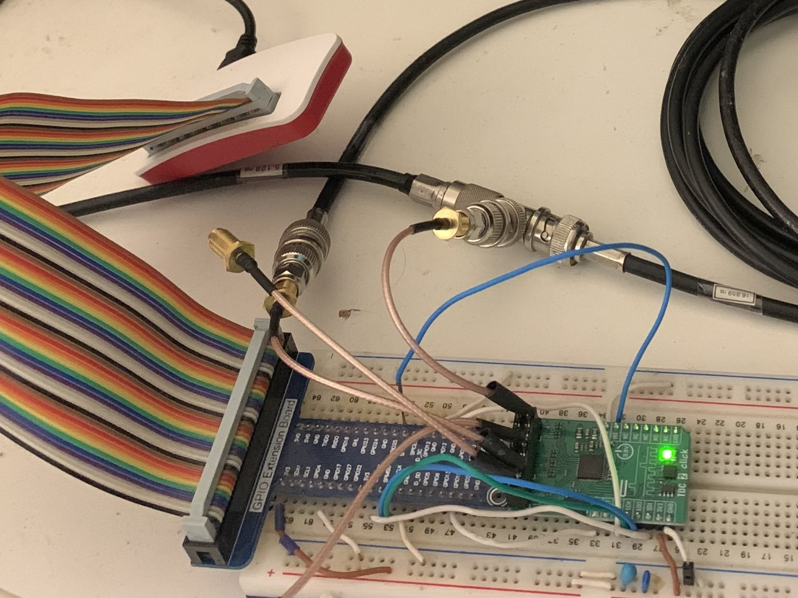

# Comparision of the ScioSense AS6500 to Texas Instrument's TDC7200

Following charts are the measurement of fixed time interval with [ScioSense AS6500](https://www.sciosense.com/products/time-to-digital-converters/as6500-time-to-digital-converter/ "ScioSense AS6500") chip and the [TDC7200 from Texas Instruments](https://www.ti.com/product/TDC7200 "TI TDC7200").
Resolution and standard deviation (RMS error) was of interrest by the measurements.

### Measurement Setup

The measurement was realised by generating 100 Hz or, in some cases, 10 Hz pulses derived from the 10 MHz reference clock.
For the division, an RP2040 chip was used.
The signal from the reference clock was wired to the XIN pin.
The chip uses an internal PLL to create a 125 MHz system clock, which was then divided down via a PIO program to 100 Hz or 10 Hz and routed to the [BUF602](https://www.ti.com/product/BUF602 "BUF602") output clock buffer driver.

The signal was split using a T-element.
One part was routed directly to the start channel, while the other continued to a cable loop and only after that headed to the stop channel.

A Vectron OCXO (C4550A1-0213 from eBay) was used as the external 10 MHz reference clock for the TIC chips and it was connected through [74LVC1G04](https://www.nexperia.com/products/analog-logic-ics/logic/buffers-inverters-transceivers/inverters/series/74LVC1G04.html "Nexperia 74LVC1G04") acting as level converter.

The measurements were conducted with different settings for the resolution of the AS6500.

[Mikroe-5570](https://www.mikroe.com/tdc-2-click "Mikroe-5570") module connected to Raspberry Pi Zero was used for interfacing the AS6500.

### Data Processing
Indications from the chips where logged to datafiles and then processed with Python and TimeLab.
10-sigma filter for outliers was applied for datafiles with `_sf` suffix.

### SR620
The SR620 measurement of the cable loop delay line was 16.859 +- 0.007 ns.

### AS6500
The specification limits for AS6500 are
- single shot RMS resolution - 20 ps or 10 ps with high (4X) resolution
- offset error - 100 ps or 200 ps with high (4X) resolution
- 0 - 16 s time interval measurement (0-1.6 s with 10 MHz ref. clock and 1ps resolution)

Measurement with standard resolution (HI-RESOLUTION OFF):

Measurement with 2x hi-resolution setting:

Measurement with 4x hi-resolution setting:

For completeness some additional measurements:

- a longer run at 10 samples per seconds with 4X hi-resolution setting:

- 100 Hz start pulses generated by HP 33120A

- LeoBodnar Mini set to 10 MHz as reference clock:

### TDC7200
The specification limits for TI TDC7200 are
- resolution 55 ps
- RMS error 35 ps
- 12 - 500 ns (mode 1) time interval measurement 
- 250ns - 8 ms (mode 2) time interval measurement

Measurement pace of 100 samples per second:

With slower measurement pace of 10 samples per second:

## Allan deviations

#### AS6500

#### TDC7200

## Datafiles
The data files are available for download from the [datafiles](datafiles "datafiles") folder.

## Conclusion
- The measurements with AS6500 did not hit the specification limit 20 ps with standard setting and 10 ps RMS error with high resolution settings, achieving a 28 ps with standard resolution and 16 ps with high resolution settings.
- The measurements with TDC7200 were below the specification limits of 55 ps resolution and 35 ps RMS error, achieving a 50 ps resolution and 16 ps RMS error
- The AS6500 has twice the resolution when used with the high-resolution setting compared to the TDC7200.
- The RMS errors (standard deviations) of the measurements from both chips are similar.
- Single shot resolution of the chips is also comparable - about 120 ps (= 5x0.0235 ps in hi-resolution mode or 3x0.047=141 ps in standard mode) for AS6500 and 150-200 ps for the TDC7200.
- Clean, stable clock sources have to be used. Using LeoBodnar as a reference clock or HP33120A for generating start pulses adds additional jitter, but on the other hand practically no outliers were observed.

## Open Questions
- The TDEV plot for TDC7200 - Why do the 10-sigma filtered traces (red and teal) have opposite direction than the non-filtered (golden yellow)?
- Why aren't the AS6500 plots straight? Is it due to temperature dependency and vibration shocks?
